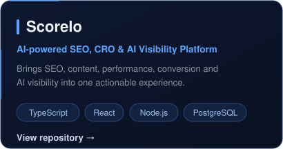
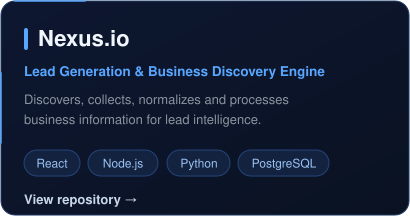
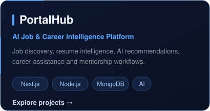
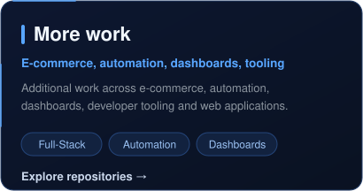
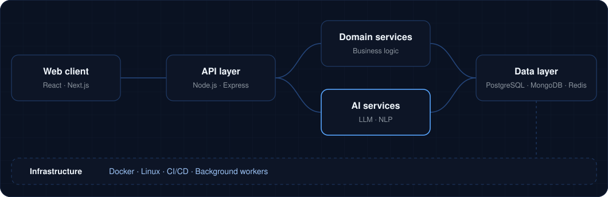

 

  

 

## About

I'm a Full-Stack Engineer building scalable web applications, AI-powered SaaS products and polished product experiences. My work spans frontend architecture, backend systems, databases, API design, automation and AI integrations.

I think in systems, build with purpose and ship with clarity.

 

## What I build

| Area | Focus |
| :-- | :-- |
| **AI & Intelligence** | LLM integrations, NLP, recommendations, intelligent workflows |
| **SaaS & Platforms** | Dashboards, analytics, business workflows, product systems |
| **Full-Stack Systems** | Frontend architecture, APIs, services, database-backed applications |
| **Data & Automation** | Discovery, scraping, normalization, background workflows |
| **Product Engineering** | UX architecture, reusable UI systems, performance and maintainability |

 

## Featured systems

<table>
<tr>
<td></td>
<td></td>
</tr>
<tr>
<td></td>
<td></td>
</tr>
</table>

 

## How I structure products

I care about clear boundaries, reliable data flows, maintainable code, and architecture that can evolve with the product.

 

## Experience

**Full-Stack Developer, Tetralogicx** &nbsp;·&nbsp; Aug 2025 – Present
Building full-stack applications, SaaS products, APIs, dashboards, integrations and AI-enabled workflows across frontend and backend systems.

**Frontend Developer, Tetralogicx** &nbsp;·&nbsp; Aug 2024 – Aug 2025
Frontend architecture, responsive product interfaces, component systems and maintainable user experiences.

**BSCS, University of Lahore**
Computer Science, with a focus on software engineering, web technologies, systems and product development.

 

## Current focus

- AI-powered SaaS architecture and LLM product integration
- Full-stack system design, PostgreSQL and data modeling
- Production-oriented backend systems
- Automation and intelligent workflows
- Developer tooling and open source

 

## Engineering principles

| | |
| :-- | :-- |
| **Design for change**   Systems that evolve without unnecessary rewrites. | **Clear boundaries**   UI, business logic, data and infrastructure kept separate. |
| **Data is architecture**   Schemas, validation, indexing and access patterns come first. | **Automate repetition**   Recurring workflows become reliable automation. |
| **Prefer simplicity**   Complexity only when the problem requires it. | **AI with purpose**   AI where it creates real product value. |

 

## Activity

 

 

## Let's build

Open to AI products, SaaS platforms, developer tools, data systems, automation and modern web applications.

 

